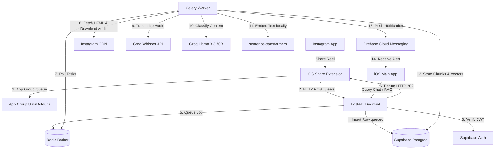

# ReelMind — Codebase Onboarding & Architecture Guide

Welcome to **ReelMind**! This document serves as your comprehensive onboarding manual to get you fully ramped up on the codebase, architecture, database schemas, and background processes of the ReelMind project.

---

## 1. Executive Summary & Core Value Proposition

ReelMind is an AI-powered personal knowledge base for saved Instagram Reels. 
* **The Problem:** Instagram's native save feature offers zero organization, zero search, and zero intelligence. Saved lists quickly become black holes of forgotten content.
* **The Solution:** ReelMind enables users to save Reels directly from Instagram via the iOS Share Sheet. A background ingestion pipeline downloads, transcribes, and auto-categorizes the Reel. The user can then query their saved library conversationally (e.g., *"Show me sunscreens for oily skin recommendation from my saves"*), receiving synthesized answers alongside visual cards referencing the source Reels.

---

## 2. System Topology

ReelMind is organized as a **monorepo** consisting of three major pillars:
1. **iOS App (SwiftUI):** The main mobile client where users browse saved reels, manage categories, and converse with the chatbot.
2. **iOS Share Extension (`URL Sharing module`):** A lightweight UIKit extension that captures Shared URLs from the OS Share Sheet, stores them locally, and invokes the backend.
3. **Backend (`backend/`):** A Python application powered by FastAPI (API server), Celery (task processor), and Supabase (database + auth).

Here is how the data flows through these services:



---

## 3. Directory Layout Tour

The repository structure is clean and keeps frontend, backend, database config, and documentation unified:

```
ReelMind/
├── frontend/                     # iOS App (Swift + SwiftUI)
│   ├── Models/                   # Data structures (e.g., Category)
│   ├── ViewModels/               # Observable view models (ReelsViewModel, etc.)
│   ├── Views/                    # SwiftUI View files (ChatView, ReelsHomeView, etc.)
│   ├── Services/                 # Interface adapters (SupabaseManager, ProfileAPI, etc.)
│   └── Config.swift              # App group keys, API base URLs, Supabase Anon key
├── URL Sharing module/           # iOS Share Sheet Extension (UIKit)
│   ├── ShareViewController.swift # URL extraction, local queuing, fire-and-forget API calls
│   └── Info.plist                # Activations rules (limits targets to URLs)
├── backend/                      # Python/FastAPI Backend
│   ├── api/                      # REST endpoints (reels, chat, profiles, health)
│   │   ├── deps.py               # Dependency injection (Auth verification)
│   │   └── v1/                   # Version 1 Router endpoints
│   ├── schemas/                  # Pydantic schemas for request/response serialization
│   ├── services/                 # core operations (downloader, transcriber, classifier, embedder, rag)
│   ├── workers/                  # Celery worker configuration, task flows, beat/scheduler
│   ├── tests/                    # Robust Pytest suite for unit/integration validation
│   ├── config.py                 # Typed configuration reading from environment
│   └── main.py                   # FastAPI app entrypoint
├── supabase/                     # Database migrations
│   └── migrations/               # SQL files applied sequentially via Supabase CLI
├── PRD/                          # Product Requirements Document
└── docs/                         # Detailed architecture and decision logs
```

---

## 4. Database Schema & Security (Supabase / Postgres)

ReelMind uses **Supabase** for user authentication, RLS (Row-Level Security) policies, and database operations. All database structures are defined as native SQL migrations under `supabase/migrations/`.

### Core Tables

1. **`profiles`:** Extensions of the default `auth.users` authentication tables. A database trigger (`on_auth_user_created`) inserts a profile row automatically on user signup.
2. **`categories`:** Organizes Reels. Shared default categories (like Skincare, Haircare, Fitness) have `user_id = NULL` and `is_default = TRUE`. Custom categories created by users have `user_id = <UUID>` and `is_default = FALSE`.
3. **`reels`:** Stores details about every saved Reel.
   * `status` field tracks pipeline state: `queued` $\rightarrow$ `processing` $\rightarrow$ `ready` (or `failed`, `uncategorised`, `pending_category`).
   * `deleted_at` enables soft-deleting.
   * `(user_id, url)` has a unique constraint to prevent duplicate ingestion.
   * `suggested_categories` stores fallback category recommendations if classification confidence is below the threshold.
4. **`reel_chunks`:** The transcript split into pieces for semantic search.
   * Contains an `embedding` column of type `vector(384)`.
   * Houses a `user_id` column (denormalized to perform rapid user-isolated vector operations without table joins).
   * Backed by an `IVFFlat` index for fast Approximate Nearest Neighbors (ANN) lookups.
5. **`chat_sessions` / `chat_messages`:** Keeps history of global or category-scoped chatbot interactions.
6. **`feedback`:** Thumbs up (+1) / Down (-1) user feedback on chat responses.

### Row-Level Security (RLS) & API Keys
Security is enforced directly by PostgreSQL via RLS:
* **The iOS App** connects using the **Supabase Anon Key**. It is bound by RLS rules that prevent users from accessing anyone else's reels, categories, or chat messages.
* **The FastAPI Backend** connects using the **Supabase Service Role Key**. This key bypasses RLS policies entirely, allowing background Celery workers to query profiles, write embeddings, or update statuses across all users. **The service role key is strictly backend-only and is never packaged in the iOS app.**

---

## 5. Ingestion Pipeline Details (Steps 14 to 22)

When a user taps "Share" on Instagram and selects ReelMind, the following sequence runs:

### Phase A: Capture & API Handoff (Sync)
1. **`ShareViewController.swift`:** UIKit captures the URL, writes it to a shared App Group sandbox (`UserDefaults(suiteName: "group.com.deepti.ReelMind")`) as a fallback queue, fetches the Supabase Auth token, and sends a POST request to the backend.
2. **`POST /api/v1/reels`:** FastAPI receives the request, parses the Bearer JWT, validates it against Supabase Auth (yielding the `user_id`), inserts a new reel row with `status="queued"` (or returns a `409 Conflict` if the URL already exists for that user), enqueues `process_reel.delay(reel_id)` to Celery, and immediately returns `202 Accepted`.

### Phase B: Background Processing (Async Workers)
The Celery task `process_reel` in `backend/workers/tasks.py` orchestrates the extraction and classification stages:

```
[Mark status="processing"] 
       ↓
[Step 15: Download Metadata & Audio] (services/downloader.py)
       ├── Scrape IG reel HTML with curl_cffi (TLS fingerprinting avoids bot detection)
       ├── Parse script tags with Parsel and extract JSON metadata 
       ├── Locate DASH manifest and extract audio-only stream (.m4a)
       └── Save metadata (caption, creator, hashtags, thumbnail) immediately to Supabase
       ↓
[Step 16: Transcribe Audio] (services/transcriber.py)
       ├── Send audio to Groq Whisper (whisper-large-v3-turbo)
       └── Persist transcript text and set has_audio (True/False)
       ↓
[Step 17 & 20: Chunk & Embed] (services/embedder.py)
       ├── Build chunk text (combines hashtags, caption, and transcript)
       ├── Generate 384-dimensional vector locally (BAAI/bge-small-en-v1.5 on CPU)
       └── Save vector and text to reel_chunks table
       ↓
[Step 18: Llama Classification] (services/classifier.py)
       ├── Fetch categories available to the user (default + custom)
       ├── Send transcript, caption, and hashtags to Groq Llama 3.3 70B
       └── Retrieve target category, confidence score, and alternative recommendations
       ↓
[Step 19: Confidence Routing & Finalization] (workers/tasks.py)
       ├── Check if confidence >= 0.70
       ├── If YES: Update status="ready", set category_id, and send push notification ("Saved to [Category]")
       ├── If NO: Update status="pending_category", store suggestions, and trigger interactive notification
       └── Finally: Clean up /tmp/ media files
```

---

## 6. Conversational RAG Architecture

ReelMind has a chat feature allowing users to converse with their library in a global or category-specific scope. The retrieval-augmented generation (RAG) system is defined in `backend/services/rag.py`:

```
User Query (e.g., "Sunscreens for oily skin")
       ↓
[HyDE Layer] 
       ├── Call Groq Llama with query and system instruction
       ├── Generate a hypothetical reel transcript that answers the query
       └── Extract structured search filters (e.g., creator_handle)
       ↓
[Embedding Layer]
       ├── Embed the hypothetical transcript via local BGE model (embed_query)
       ↓
[Retrieval Layer]
       ├── Execute match_reel_chunks RPC in Postgres (searches vectors)
       ├── Filters results by user_id, category_id, and creator_handle
       └── Groups results by reel_id, selecting the top 5 unique reels
       ↓
[Generation Layer]
       ├── Format retrieved transcripts into prompt context
       ├── Send context, chat history (last 6 messages), and query to Llama 3.3 70B
       └── Return the text answer + structured source list for UI card mapping
```

---

## 7. Configuration & Environment Setup

### Required Secrets (`backend/.env`)
Create a `.env` file in `backend/` using `backend/.env.example` as a template:
```env
SUPABASE_URL=https://<your-project>.supabase.co
SUPABASE_ANON_KEY=eyJhbGciOi...
SUPABASE_SERVICE_ROLE_KEY=eyJhbGciOi...
GROQ_API_KEY=gsk_...
REDIS_URL=redis://localhost:6379
FIREBASE_SERVICE_ACCOUNT_JSON=eyJh... # Base64-encoded Firebase Admin SDK service account key
```

### Local Execution Checklist

To run the entire stack locally:

1. **Start Redis (Task Queue Broker):**
   ```bash
   cd backend
   docker compose up -d
   ```
2. **Start FastAPI API Server:**
   ```bash
   cd backend
   source venv/bin/activate
   pip install -r requirements.txt
   uvicorn main:app --reload --host 0.0.0.0 --port 8000
   ```
3. **Start Celery Background Workers:**
   ```bash
   cd backend
   source venv/bin/activate
   celery -A workers.celery_app worker --loglevel=info
   ```
4. **Expose Local API to iOS Client:**
   ```bash
   ngrok http 8000
   ```
   *Copy the generated HTTPS ngrok URL and update `K.backendBaseURL` in the `URL Sharing module` (ShareViewController.swift) and `Config.swift`.*
5. **Xcode Configuration:**
   * Open `ReelMind.xcworkspace` in Xcode.
   * Verify that **App Groups** are enabled for both the main `ReelMind` app target and the `URL Sharing module` share extension target, with both pointing to `group.com.deepti.ReelMind`.
   * Compile and launch on simulator or device.

---

## 8. Development Verification Tools

The backend uses `pytest` for validation. Run all tests with the virtual environment active:
```bash
cd backend
pytest
```
Tests are comprehensive and cover:
* Scraping and HTML parsing fallbacks (`test_downloader_fallback.py`)
* Audio file processing / ffmpeg utilities (`test_ffmpeg_utils.py`)
* Local embedding generation dimensions and norms (`test_embedder.py`)
* Groq Llama classification structures and JSON schemas (`test_classifier.py`)
* Resilience of Celery task retries and error conditions (`test_tasks_resilience.py`)
* RAG retrieval pipelines (`test_rag.py`)
